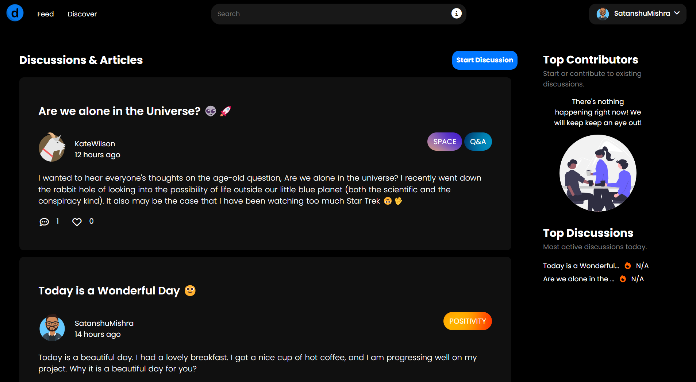
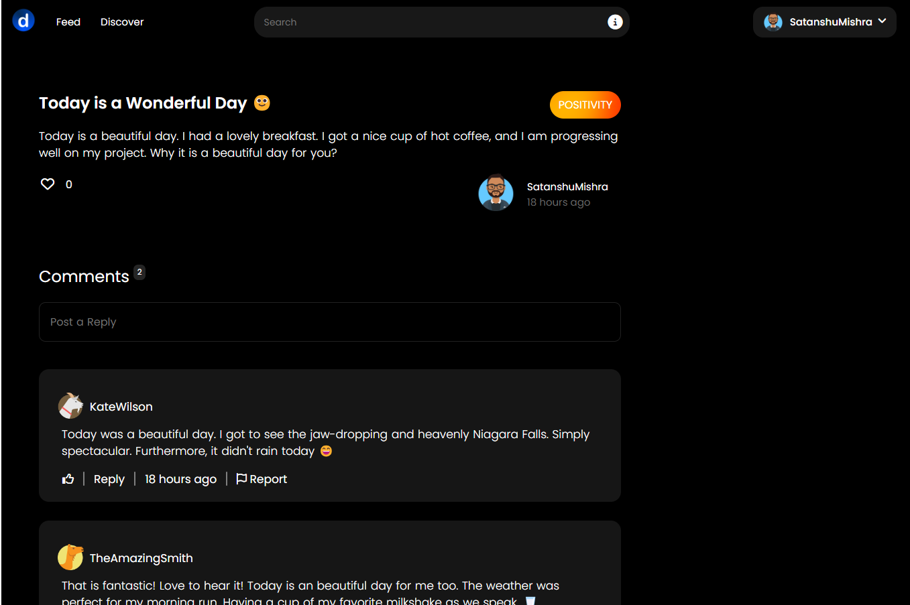
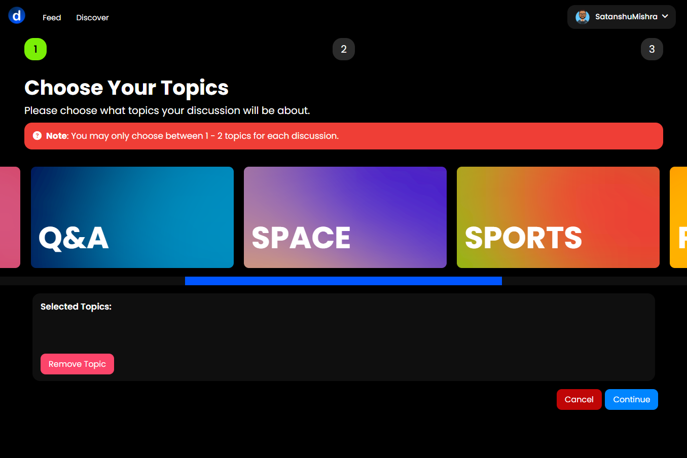
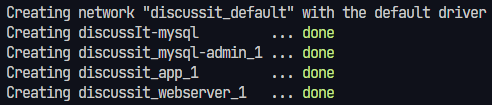

   

      
   

   

      
      
      
      
      
      
      
   

## Overview

 <b style="color:#0085FF; font-weight: 800;">discussIt</b> is an unique take on a discussion website combining popular features from both social media apps and forums. This website aims to provide users with a medium to have focused discussions without distractions.

Here are some examples of our website.  Please remember that due to the nature of the website, these screenshots may not match the look of the website upon your visit.

   

      
      
<b>The Feed</b>: This is what every user it greeted with when they enter the website, regardless of whether they are logged in or not.

   

   

   
      
<b>An Discussions</b>: This is what a discussion page looks like. Selecting a discussion from the feed will bring the user to a page similar to this. <b>Note</b>: Options available may vary depending on if the user is logged in.

   

   

   
      
<b>Create a Discussion</b>: This is the first out of three pages when creating a discussion. This is where the user can select the topic(s) their discussion is based around. The two subsequent pages include entering the title and content of the discussion and reviewing the content entered before posting.

   

## Getting Started

**Prerequisites:**

- Download & Install [Docker Desktop](https://www.docker.com/).
- At least 1.59 GB of space locally in addition to the space required by Docker.
- Stable Internet Connection

Follow the following steps to run our website locally:

1. Clone the repository to our local machine.
2. Start Docker Desktop.
3. Open a new terminal window within the newly cloned repository folder.
4. Run `docker-compose up -d` within the terminal window. **Note:** depending on your internet speed, this may take
   anywhere from a few seconds to a few minutes. This step tells docker to download all the resources required to run the
   website on your local machine. When docker has successfully completed installing and started all required resouces, you
   should see something similar to this within your terminal window:

5. Congratulations! The website is now up and running! To access the website, open any web browser (excluding Safari)
   and navigate to the following links depending on where you want to go:

a. You can access the website at `localhost` or `localhost/80:80`. 
b. You can access the database at `localhost:8080`. The credentials to login to the database are, **Server**:
`discussIt-mysql`, Username: `discussIt`, & Password: `password`. These credentials may be changed in
`docker-compose.yml`.

> **IMPORTANT**
> Upon first opening our website, there will be no user's or discussion's within our website due to the database being
> empty.
>
> If you wish to give yourself administrator permissions, after signing up, log in to the database. Then navigate to the
> `user` table and for the account you desire, change the value of `administratorPermissions` to `1`. **You will only need
> to do this for the first admin user.** Any subsequent updates can be made via the administrator portal.

## Contributors

This website was designed by the following contributors:

1. [Satanshu Mishra](https://github.com/SatanshuMishra)
2. [Blake Ablitt](https://github.com/blakeablitt)
